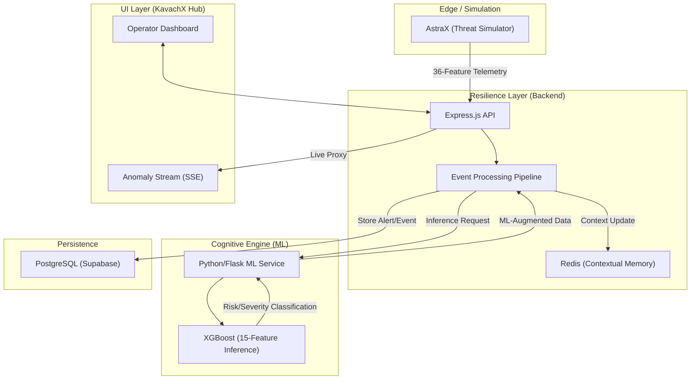
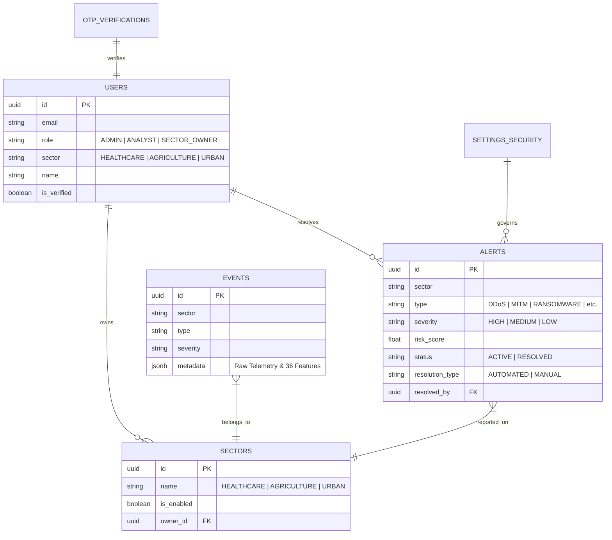

# 🛡️ KavachX: Cyber-Resilient Infrastructure Platform

[](https://github.com/OddlyEvenn/KavachX)
[](https://reactjs.org/)
[](https://nodejs.org/)
[](https://supabase.com/)

**KavachX** is a next-generation security monitoring and autonomous resilience platform engineered for critical infrastructure preservation. It provides real-time oversight for three primary sectors: **Healthcare**, **Agriculture**, and **Urban Systems**, utilizing advanced 15-feature XGBoost Machine Learning to detect, classify, and mitigate cyber-kinetic threats.

---

## 🏗️ System Architecture

KavachX operates on a distributed 3-tier architecture designed for high throughput and low-latency inference.



---

## 📊 Data Model (ER Diagram)

The core data structure ensures strict relationship integrity between operational events, classified alerts, and governance policies.



---

## 🔬 Cognitive Intelligence (ML)

The heart of KavachX is its **15-Feature Ensemble Classifier**, which reduces 36 raw telemetry points into actionable security heuristics.

-   **Raw Ingestion**: 36 diverse features (Packet counts, Entropy, Authentication states, SSL validations, etc.).
-   **Ensemble Engine**: XGBoost model performing multi-output prediction for Attack Detection and Attack Classification simultaneously.
-   **Risk Scoring**: Dynamic calculation based on `anomaly_score`, `confidence`, and `attack_velocity`.

---

## ⚡ Key Modules

1. **AstraX Simulator**: A precision tool for stress-testing infrastructure by injecting simulated multi-vector attacks.
2. **Telemetry Lab**: Interactive grid-monitoring for hardware and network utilization metrics.
3. **Autonomous Defense**: Governance-driven "Self-Healing" that executes mitigations (IP blocking, account lockout) without human intervention based on ML severity.
4. **Sector Dossiers**: Instant PDF auditing reports generated from live threat databases.

---

## ⚙️ Deployment & Setup

### Requirements
- Node.js v18+
- Python 3.9+
- Redis Server
- PostgreSQL (Supabase recommended)

### 1. Inception (ML Service)
```bash
cd ML
python -m venv venv
source venv/bin/activate # or venv\Scripts\activate
pip install -r requirements.txt
python app.py
```

### 2. Core (Backend)
```bash
cd backend
npm install
npm run dev
```

### 3. Interface (Frontend)
```bash
cd frontend
npm install
npm run dev
```

---

## 🔑 Environment Configuration

Ensure `.env` files are configured in both `backend` and `frontend` directories.

**Backend (.env)**:
```env
PORT=5001
JWT_SECRET=your_secret
DATABASE_URI=your_postgres_uri
REDIS_URL=redis://localhost:6379
BREVO_API_KEY=your_key
ML_API_URL=http://localhost:5000/api/ml/analyze
```

---

## 🤝 Contributors

*Names to be provided...*

---
*Created for Advanced Agentic Coding.*
*Team Cache Me If You Can*
