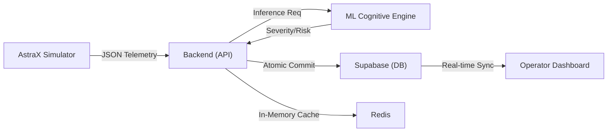

# 🛡️ KAVACH-X: CRITICAL INFRASTRUCTURE RESILIENCE

```text
██╗  ██╗ █████╗ ██╗   ██╗ █████╗  ██████╗██╗  ██╗██╗  ██╗
██║ ██╔╝██╔══██╗██║   ██║██╔══██╗██╔════╝██║  ██║╚██╗██╔╝
█████╔╝ ███████║██║   ██║███████║██║     ███████║ ╚███╔╝ 
██╔═██╗ ██╔══██║╚██╗ ██╔╝██╔══██║██║     ██╔══██║ ██╔██╗ 
██║  ██╗██║  ██║ ╚████╔╝ ██║  ██║╚██████╗██║  ██║██╔╝ ██╗
╚═╝  ╚═╝╚═╝  ╚═╝  ╚═══╝  ╚═╝  ╚═╝ ╚═════╝╚═╝  ╚═╝╚═╝  ╚═╝
[ SYSTEM STATUS: OPERATIONAL ] [ ENCRYPTION: ACTIVE ]
```


**KavachX** is an autonomous cyber-kinetic defense platform designed to preserve the operational integrity of critical infrastructure. It integrates real-time telemetry ingestion with 15-feature XGBoost ensemble inference to provide high-fidelity threat detection and automated response protocols.

---

## 🏗️ SYSTEM ARCHITECTURE & DATA FLOW

### Horizontal Operational Flow


---

## 🏛️ THREE-SECTOR RESILIENCE PARADIGM

KavachX provides context-aware security for three vital infrastructure domains:

-   🏥 **HEALTHCARE INFRASTRUCTURE**: Protecting patient telemetry, medical IoT (IoMT), and diagnostic data integrity from ransomware and synchronization attacks.
-   🌾 **SMART AGRICULTURE**: Securing irrigation control systems, soil sensor arrays, and supply-chain logistics against unauthorized interception.
-   🏙️ **URBAN MUNICIPAL SYSTEMS**: Defending smart grid actuators, traffic control processors, and water management telemetry from DDoS and lateral movements.

---

## 📊 DATA MODEL (ER DIAGRAM)

The core data structure ensures strict relationship integrity between operational events, classified alerts, and governance policies.

```mermaid
erDiagram
    USERS ||--o{ ALERTS : "resolves"
    ALERTS }|--|| SECTORS : "reported_on"
    EVENTS }|--|| SECTORS : "belongs_to"
    USERS ||--o{ SECTORS : "owns"
    OTP_VERIFICATIONS ||--|| USERS : "verifies"
    SETTINGS_SECURITY ||--o{ ALERTS : "governs"
    
    USERS {
        uuid id PK
        string email
        string role "ADMIN | ANALYST | SECTOR_OWNER"
        string sector "HEALTHCARE | AGRICULTURE | URBAN"
        string name
        boolean is_verified
    }
    
    ALERTS {
        uuid id PK
        string sector
        string type "DDoS | MITM | RANSOMWARE | etc."
        string severity "HIGH | MEDIUM | LOW"
        float risk_score
        string status "ACTIVE | RESOLVED"
        string resolution_type "AUTOMATED | MANUAL"
        uuid resolved_by FK
    }

    EVENTS {
        uuid id PK
        string sector
        string type
        string severity
        jsonb metadata "Raw Telemetry & 36 Features"
    }

    SECTORS {
        uuid id PK
        string name "HEALTHCARE | AGRICULTURE | URBAN"
        boolean is_enabled
        uuid owner_id FK
    }
```



---

## 🛡️ CORE SECURITY HEURISTICS (ML)

The KavachX Cognitive Engine distills 36 raw data points into **7 Essential Vulnerability Pillars**:

| Pillar | Focus Area | Detection Vector |
| :--- | :--- | :--- |
| **Login Failure Sigma** | Identity & Access | Bruteforce, Credential Stuffing |
| **Payload Entropy** | Network Traffic | Anomalous Packet Size, Buffer Overflows |
| **SYN-Flood Coefficient** | Availability | TCP State Exhaustion, DDoS |
| **MITM Risk Index** | Data Integrity | ARP Spoofing, SSL/TLS Mismatch |
| **Ransomware Vector** | File Integrity | Unauthorized IO, Modification Rate Spikes |
| **Topology Scan Risk** | Reconnaissance | Port Scanning, Horizontal Movement |
| **Phishing Probability** | Human Vector | Domain Age, Keyword Entropy, Redirections |

---

## ⚙️ DEPLOYMENT SOP (Standard Operating Procedure)

To initialize the KavachX ecosystem, synchronize the primary services in order:

### 1. Inception (ML COGNITIVE ENGINE)
```bash
cd ML
pip install -r requirements.txt
python app.py
```

### 2. Core (RESILIENCE GATEWAY)
```bash
cd backend
npm install
npm run dev
```

### 3. Interface (OPERATOR HUB)
```bash
cd frontend
npm install
npm run dev
```

---

## 🤝 PROJECT CONTRIBUTORS

*Names to be provided by the Command Lead...*

---

```text
--------------------------------------------------------------------------------
[ KAVACH-X CORE ] [ SECURITY PROTOCOL: V4.0 ] [ AUTHORIZED ACCESS ONLY ]
--------------------------------------------------------------------------------
```
*DESIGNED FOR ADVANCED AGENTIC CODING*  
*Team: Cache Me If You Can*
