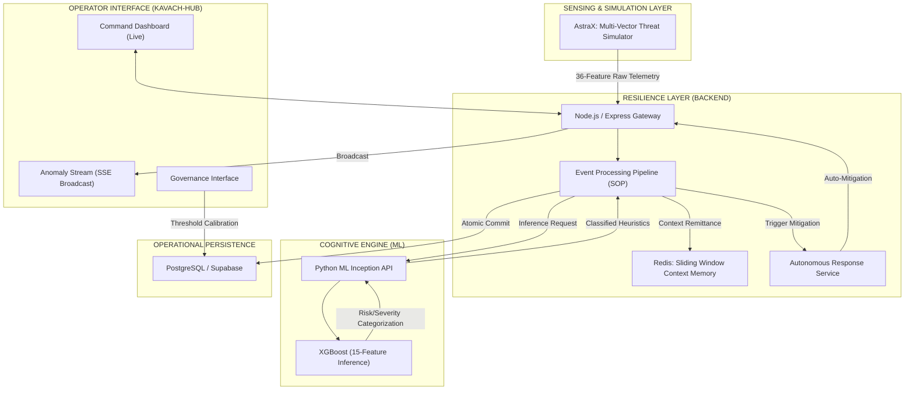
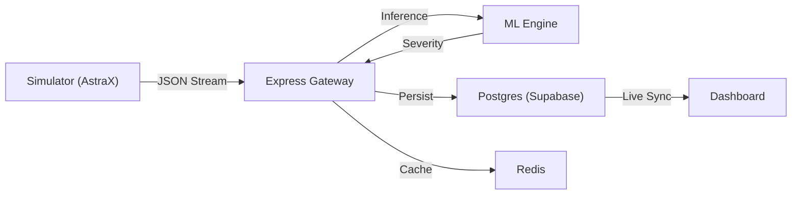
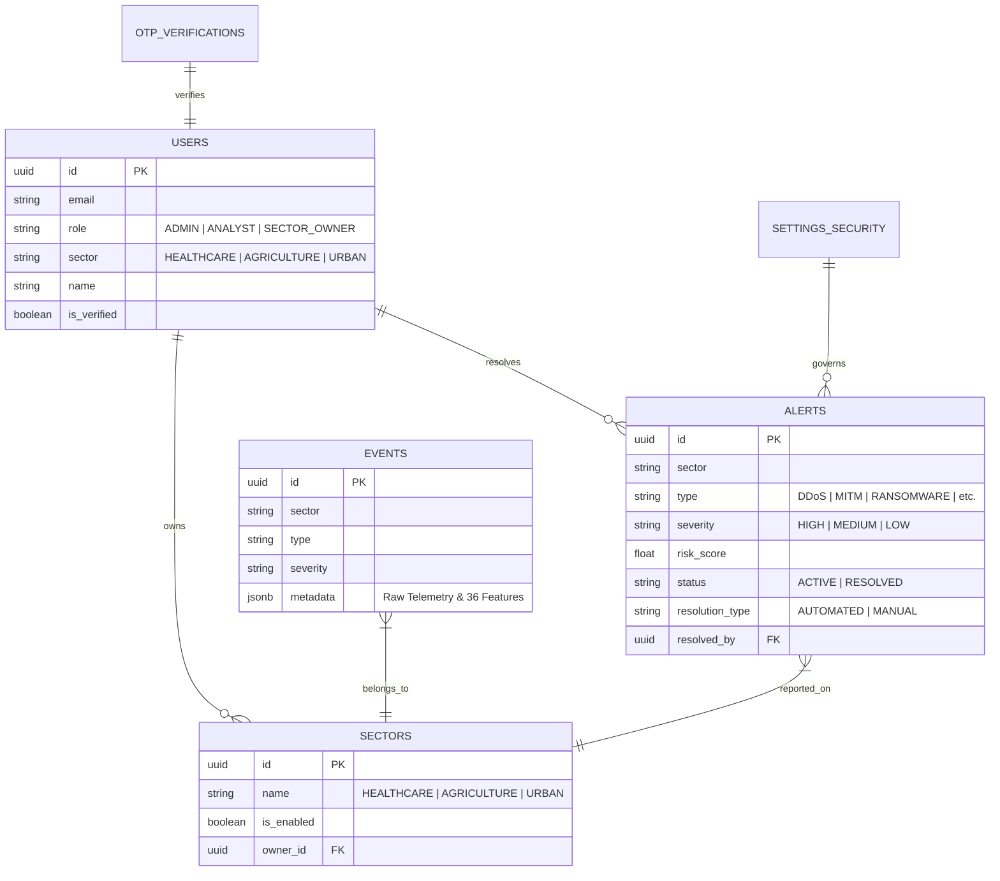

<div align="center">

# 🛡️ KAVACH-X
### **ADVANCED CYBER-RESILIENT INFRASTRUCTURE PRESERVATION**


**"Securing the Digital Nervous System of Critical Infrastructure"**

[**LEARN MORE**](#-mission-overview) • [**SYSTEM ARCHITECTURE**](#-tactical-architecture) • [**THREAT HEURISTICS**](#-cognitive-intelligence-ml) • [**SOP DEPLOYMENT**](#-deployment-sop)

---
</div>

## 🌐 MISSION OVERVIEW

**KavachX** (Armour-X) is a high-fidelity security monitoring and autonomous resilience platform designed for the preservation of critical infrastructure. In an era of cyber-physical threats, KavachX provides a multi-tenant oversight layer for three vital domains:

*   🏥 **HEALTHCARE INFRASTRUCTURE**: Defending patient telemetry and IoMT devices from ransomware and synchronization disruption.
*   🌾 **SMART AGRICULTURE**: Preserving irrigation grid integrity and nutrient-delivery sensor arrays from unauthorized interception.
*   🏙️ **URBAN MUNICIPAL SYSTEMS**: Protecting smart grid actuators and water management systems from large-scale DDoS and lateral penetration.

---

## 📈 TACTICAL ARCHITECTURE

### **I. High-Fidelity Infrastructure Map**
The KavachX ecosystem is a distributed 3-tier intelligence network.



### **II. Operational Horizontal Flow**
A streamlined view of the "Ingestion-to-Alert" lifecycle.



---

## 📊 DATA MODEL (ER DIAGRAM)

The core data structure ensures strict relationship integrity between operational events, classified alerts, and governance policies.



---

## 🔬 COGNITIVE INTELLIGENCE (ML)

The KavachX Cognitive Engine distills 36 raw telemetry points into **7 Essential Vulnerability Pillars**:

| Pillar | Focus Area | High-Risk Indicators |
| :--- | :--- | :--- |
| **Login Failure Sigma** | Identity & Access | Bruteforce, Credential Stuffing, Parallel Auth |
| **Payload Entropy** | Network Traffic | Anomalous Packet Size, Buffer Overflows, Malformed Headers |
| **SYN-Flood Coefficient** | Availability | TCP State Exhaustion, DDoS, Half-Open Connections |
| **MITM Risk Index** | Data Integrity | ARP Spoofing, SSL/TLS Mismatch, Certificate Hijacks |
| **Ransomware Vector** | File Integrity | Unauthorized IO, Modification Rate Spikes, Encrypted Extension Renames |
| **Topology Scan Risk** | Reconnaissance | Port Scanning, Horizontal Movement, Nmap Indicators |
| **Phishing Probability** | Human Vector | Domain Age, Keyword Entropy, URL Redirections |

---

## 🛡️ DEFENSIVE MEASURES & CONTROLS

| Control | Protocol | Operational Outcome |
| :--- | :--- | :--- |
| **Autonomous Defense** | Direct Suppression | Automated firewall rules & IP blocking for HIGH severity threats. |
| **Identity Sovereignty** | JWT/HTTP-Only | Zero-persistence session tokens; immunity to XSS-based hijacking. |
| **Database Isolation** | Postgres RLS | Strict Row-Level Security ensures SECTOR_OWNERS never bleed data. |
| **Telemetry Recalibration** | Dynamic Thresholds | Admins can adjust ML sensitivity (Sigma thresholds) on the fly. |
| **Cryptographic Rotation** | API Key Cycling | Instant token expiration to neutralize compromised data streams. |

---

## ⚙️ DEPLOYMENT SOP

Initialize the KavachX ecosystem following this precise sequence:

### **SOP-01: ML COGNITIVE ENGINE**
```bash
cd ML
python -m venv venv
source venv/bin/activate
pip install -r requirements.txt
python app.py
```

### **SOP-02: RESILIENCE GATEWAY (BACKEND)**
```bash
cd backend
npm install
# Configure .env with Supabase & Redis credentials
npm run dev
```

### **SOP-03: OPERATOR HUB (FRONTEND)**
```bash
cd frontend
npm install
npm run dev
```

---

## 🤝 PROJECT CONTRIBUTORS

*Lead Command & Contributors to be documented...*

---

<div align="center">

**[ 🛡️ SECURE ] [ ⚡ RESILIENT ] [ 🧠 AUTONOMOUS ]**

```text
--------------------------------------------------------------------------------
[ KAVACH-X CORE ] [ SECURITY PROTOCOL: V4.0 ] [ AUTHORIZED ACCESS ONLY ]
--------------------------------------------------------------------------------
```

*DESIGNED FOR THE ADVANCED AGENTIC CODING CHALLENGE*  
*Team: Cache Me If You Can*

</div>
