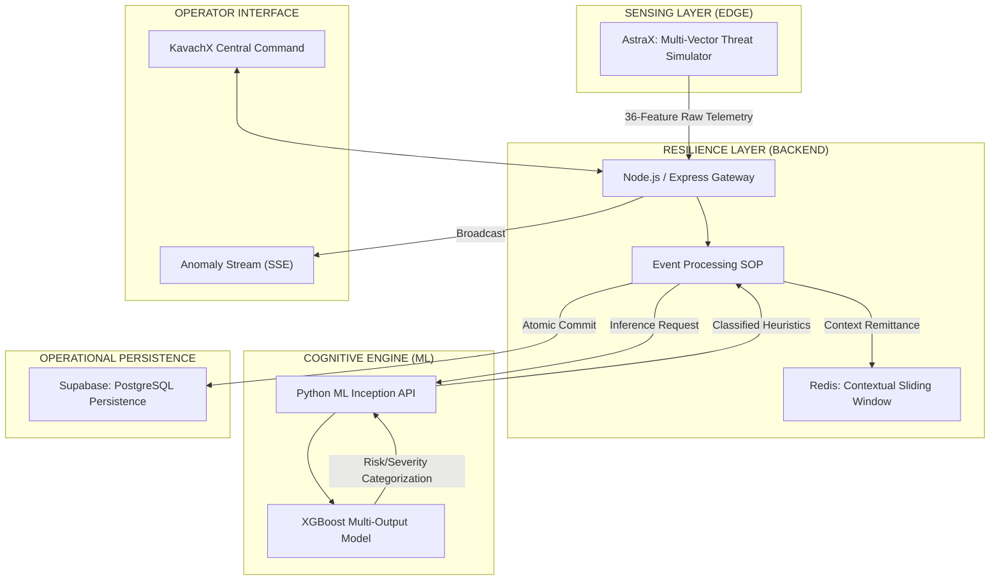

# 🛡️ KAVACH-X: CRITICAL INFRASTRUCTURE RESILIENCE

 


**KavachX** (Armor-X) is an autonomous cyber-kinetic defense platform designed to preserve the operational integrity of critical infrastructure. It integrates real-time telemetry ingestion with 15-feature XGBoost ensemble inference to provide high-fidelity threat detection and automated response protocols.

---

## 🏛️ THREE-SECTOR RESILIENCE PARADIGM

KavachX provides context-aware security for three vital infrastructure domains:

-   🏥 **HEALTHCARE INFRASTRUCTURE**: Protecting patient telemetry, medical IoT (IoMT), and diagnostic data integrity from ransomware and synchronization attacks.
-   🌾 **SMART AGRICULTURE**: Securing irrigation control systems, soil sensor arrays, and supply-chain logistics against unauthorized interception.
-   🏙️ **URBAN MUNICIPAL SYSTEMS**: Defending smart grid actuators, traffic control processors, and water management telemetry from DDoS and lateral movements.

---

## 🏗️ TACTICAL SYSTEM ARCHITECTURE



---

## 📊 CORE SECURITY HEURISTICS (ML)

The KavachX Cognitive Engine distills 36 raw data points into **7 Essential Vulnerability Pillars**:

| Pillar | Focus Area | Detection Vector |
| :--- | :--- | :--- |
| **Login Failure Sigma** | Identity & Access | Bruteforce, Credential Stuffing |
| **Payload Entropy** | Network Traffic | Anomalous Packet Size, Buffer Overflows |
| **SYN-Flood Coefficient** | Availability | TCP State Exhaustion, DDoS |
| **MITM Risk Index** | Data Integrity | ARP Spoofing, SSL/TLS Mismatch |
| **Ransomware Vector** | File Integrity | Unauthorized IO, Modification Rate Spikes |
| **Topology Scan Risk** | Reconnaissance | Port Scanning, Horizontal Movement |
| **Phishing Probability** | Human Vector | Domain Age, Keyword Entropy, Redirections |

---

## 🛡️ GOVERNANCE & CONTROL MATRIX

| Feature | Protocol | Purpose |
| :--- | :--- | :--- |
| **Autonomous Defense** | Direct Suppression | Automated IP blocking for HIGH severity threats. |
| **Identity Sovereignty** | JWT/HTTP-Only | Secure session management without client-side persistence. |
| **Database Integrity** | Postgres RLS | Strict Row-Level Security for multi-tenant data isolation. |
| **Telemetry Recalibration** | Dynamic Thresholds | Real-time adjustment of ML sensitivity by authorized Admins. |
| **Cryptographic Rotation** | API Key Cycling | Instant invalidation of leaked or stale ingestion tokens. |

---

## ⚙️ DEPLOYMENT SOP (Standard Operating Procedure)

To initialize the KavachX ecosystem, synchronize the primary services in order:

### 1. Inception (ML COGNITIVE ENGINE)
```bash
cd ML
pip install -r requirements.txt
python app.py
```

### 2. Core (RESILIENCE GATEWAY)
```bash
cd backend
npm install
npm run dev
```

### 3. Interface (OPERATOR HUB)
```bash
cd frontend
npm install
npm run dev
```

---

## 🤝 PROJECT CONTRIBUTORS

*Names to be provided by the Command Lead...*

---
**DESIGNED FOR ADVANCED AGENTIC CODING**  
*Team: Cache Me If You Can*
